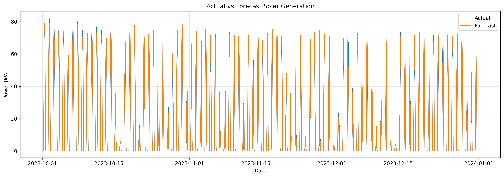
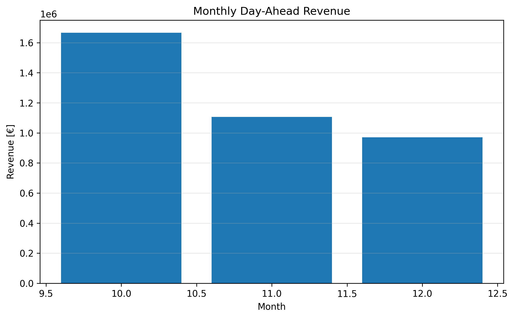

# Short-Term Renewable Generation Forecasting and Day-Ahead Power Trading

This project develops an end-to-end machine learning pipeline for **short-term photovoltaic generation forecasting** and **Day-Ahead electricity market trading**.

The workflow combines weather-based renewable generation forecasting with historical electricity market prices to simulate a simplified Day-Ahead trading strategy and evaluate its financial performance under realistic imbalance cost scenarios.

The project demonstrates how machine learning can support renewable energy producers in reducing forecast uncertainty, improving market participation, and increasing trading revenues.

---

# Project Overview

Renewable energy producers participating in Day-Ahead electricity markets must submit generation schedules before actual production is known.

Because photovoltaic generation strongly depends on weather conditions, forecast errors inevitably create **energy imbalances**, which may reduce trading revenues through imbalance settlement costs.

This project reproduces a simplified version of this real-world workflow by:

- analysing historical Italian Day-Ahead electricity prices;
- forecasting hourly photovoltaic generation using weather variables;
- constructing a Day-Ahead trading position from generation forecasts;
- evaluating forecast errors and imbalance exposure;
- estimating portfolio revenues under different imbalance cost assumptions.

---

# Project Workflow

The complete workflow follows a realistic renewable trading pipeline:

```
Italian Day-Ahead Market Prices
               │
               ▼
        Market Analysis
               │
               ▼
    PVGIS Solar Generation Data
               │
               ▼
      Feature Engineering
               │
               ▼
 Machine Learning Forecasting
               │
               ▼
      Day-Ahead Position
               │
               ▼
     Imbalance Calculation
               │
               ▼
      Revenue Simulation
               │
               ▼
 Portfolio & Scenario Analysis
```

---

# Notebooks

The project is organised into four notebooks following the complete analytical workflow.

## 01 – Market Analysis

Exploratory analysis of the Italian Day-Ahead electricity market.

Main topics:

- electricity price distribution
- hourly price behaviour
- monthly seasonality
- market volatility
- descriptive statistics

---

## 02 – Renewable Generation Forecasting

Development and evaluation of photovoltaic generation forecasting models.

Main topics:

- PVGIS photovoltaic generation data
- weather feature engineering
- synthetic irradiance forecast generation
- Linear Regression benchmark
- Random Forest forecasting model
- model comparison
- feature importance analysis

---

## 03 – Day-Ahead Trading Strategy

Simulation of renewable energy trading based on machine learning forecasts.

Main topics:

- forecast alignment
- Day-Ahead position construction
- imbalance calculation
- revenue estimation
- intraday imbalance analysis
- seasonal revenue analysis

---

## 04 – Portfolio Performance Analysis

Evaluation of portfolio performance under different imbalance settlement assumptions.

Main topics:

- portfolio KPIs
- trading performance assessment
- imbalance cost scenarios
- net revenue comparison
- business implications

---

# Dataset

The project combines multiple data sources.

## Italian Day-Ahead Electricity Market

Historical hourly electricity prices (PUN Index GME) published by the Italian Electricity Market Operator (GME).

Main variable:

- electricity price [€/MWh]

---

## PVGIS Solar Generation

Hourly photovoltaic generation simulations obtained from the PVGIS platform for a representative solar portfolio located near Bari, Southern Italy.

Weather variables include:

- solar irradiance
- sun height
- air temperature
- wind speed

Target variable:

- photovoltaic generation [kW]

---

## Generated Forecast Dataset

Machine learning forecasts generated within the project are subsequently used to simulate renewable energy trading.

---

# Machine Learning Pipeline

The forecasting workflow follows the steps below:

```
Raw Data

↓

Data Cleaning

↓

Feature Engineering

↓

Synthetic Weather Forecast

↓

Chronological Train/Test Split

↓

Linear Regression

↓

Random Forest

↓

Forecast Evaluation

↓

Trading Simulation
```

Chronological splitting is used throughout the project to preserve the temporal structure of the data and avoid information leakage.

---

# Models Compared

Two forecasting models are evaluated.

## Linear Regression

Provides a simple and interpretable baseline model.

---

## Random Forest Regressor

Captures nonlinear relationships between weather conditions and photovoltaic generation.

The Random Forest consistently outperforms the linear baseline and is therefore selected for the trading simulation.

---

# Evaluation Metrics

Forecast performance is evaluated using:

- **MAE** — Mean Absolute Error
- **RMSE** — Root Mean Squared Error
- **R²** — Coefficient of Determination

These complementary metrics provide a comprehensive assessment of forecasting accuracy.

---

# Trading Framework

The simplified trading strategy follows the standard Day-Ahead market process.

```
Generation Forecast

↓

Day-Ahead Position

↓

Actual Generation

↓

Forecast Error

↓

Energy Imbalance

↓

Day-Ahead Revenue

↓

Portfolio Performance
```

The project assumes that the committed Day-Ahead position equals the forecast photovoltaic generation.

Differences between forecast and actual production generate imbalance volumes, whose financial impact is analysed through multiple settlement cost scenarios.

---

# Results

The forecasting model achieves excellent predictive performance while supporting robust trading outcomes.

## Forecast Performance

The Random Forest model accurately reproduces hourly photovoltaic generation patterns across the test period, providing reliable forecasts for Day-Ahead trading applications.



| Metric | Result |
|---------|--------|
| Random Forest MAE | **1.07 kW** |
| Random Forest RMSE | **2.50 kW** |
| Random Forest R² | **0.988** |
| Average Absolute Imbalance | **1.06 kW** |
| Total Day-Ahead Revenue | **€3.74 M** |

Feature importance analysis shows that **forecast solar irradiance** is by far the dominant predictor of photovoltaic generation, confirming the central role of weather information in renewable energy forecasting.

Scenario analysis further demonstrates that the trading strategy remains profitable across a range of imbalance settlement cost assumptions.

## Trading Performance

The simulated Day-Ahead trading strategy generates stable revenues throughout the evaluation period.

Although monthly revenues vary because of seasonal changes in photovoltaic production and market prices, the forecasting-driven strategy consistently produces positive trading income.



These results illustrate how accurate renewable generation forecasts can be effectively translated into robust Day-Ahead trading strategies and stable portfolio revenues.

---

# Repository Structure

```
short-term-power-trading/
│
├── data/
│   ├── raw/
│   └── processed/
│
├── images/
│   ├── forecast_performance.png
│   └── monthly_revenue.png
│
├── notebooks/
│   ├── 01_market_analysis.ipynb
│   ├── 02_generation_forecast.ipynb
│   ├── 03_trading_strategy.ipynb
│   └── 04_pnl_analysis.ipynb
│
├── src/
│   ├── __init__.py
│   ├── data_loader.py
│   ├── forecasting.py
│   ├── metrics.py
│   └── trading.py
│
├── README.md
└── requirements.txt
```

---

# Technologies Used

- Python
- Pandas
- NumPy
- Scikit-learn
- Matplotlib
- Jupyter Notebook

---

# How to Run the Project

## 1. Clone the repository

```bash
git clone https://github.com/sbaffo0106/short-term-power-trading.git
cd short-term-power-trading
```

## 2. Install the required dependencies

```bash
pip install -r requirements.txt
```

## 3. Run the notebooks sequentially

1. `01_market_analysis.ipynb`
2. `02_generation_forecast.ipynb`
3. `03_trading_strategy.ipynb`
4. `04_pnl_analysis.ipynb`

Each notebook builds upon the outputs generated by the previous one.

---

# Future Improvements

Possible extensions include:

- integration of real weather forecast APIs
- probabilistic photovoltaic forecasting
- hyperparameter optimisation
- battery storage optimisation
- intraday electricity market strategies
- imbalance price modelling
- portfolio optimisation under risk constraints

---

# Author

**Antonio Sbaffoni**

Machine learning project focused on **renewable energy forecasting**, **electricity market analytics**, and **quantitative trading applications**.

GitHub: https://github.com/sbaffo0106

LinkedIn: https://www.linkedin.com/in/dr-antonio-sbaffoni-85644a184/